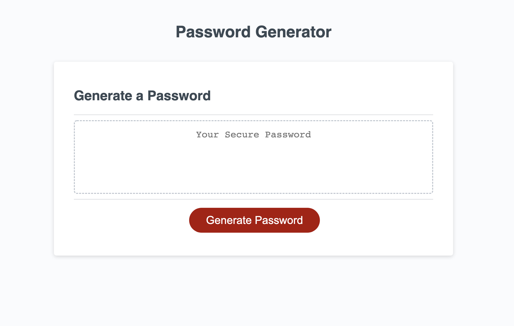

# Password Generator

## Description

This project uses Javascript to put together a random password given a length and what characters/numbers the user desired it to consist of. It uses stored arrays of characters to pick random entities from and combines these into a password which is then written to the webpage.

## Installation

This project requires no installation. The files can be copied to a directory and run from their if the original folder levels are preserved.

## Usage

Opening 'index.html' in a web browser will bring up the main screen. Clicking on the 'Generate Password' button starts the process. You will be asked how long the password will be (8 to 128 characters), if you want uppercase characters to be used, lowercase characters, numeric characters, and special characters to be used. You must choose at least on of the former four choices to have a password be generated.

<h2><u>Screenshot:</u></h2>

## Credits

I would like to thank my class instructor [Farish Kashefinejad](https://www.linkedin.com/in/farishkash) for his invaluable help in helping me better understand the requirements of this project.

## License

MIT License

Copyright (c) 2022 Cliff Rosenberg

Permission is hereby granted, free of charge, to any person obtaining a copy
of this software and associated documentation files (the "Software"), to deal
in the Software without restriction, including without limitation the rights
to use, copy, modify, merge, publish, distribute, sublicense, and/or sell
copies of the Software, and to permit persons to whom the Software is
furnished to do so, subject to the following conditions:

The above copyright notice and this permission notice shall be included in all
copies or substantial portions of the Software.

THE SOFTWARE IS PROVIDED "AS IS", WITHOUT WARRANTY OF ANY KIND, EXPRESS OR
IMPLIED, INCLUDING BUT NOT LIMITED TO THE WARRANTIES OF MERCHANTABILITY,
FITNESS FOR A PARTICULAR PURPOSE AND NONINFRINGEMENT. IN NO EVENT SHALL THE
AUTHORS OR COPYRIGHT HOLDERS BE LIABLE FOR ANY CLAIM, DAMAGES OR OTHER
LIABILITY, WHETHER IN AN ACTION OF CONTRACT, TORT OR OTHERWISE, ARISING FROM,
OUT OF OR IN CONNECTION WITH THE SOFTWARE OR THE USE OR OTHER DEALINGS IN THE
SOFTWARE.